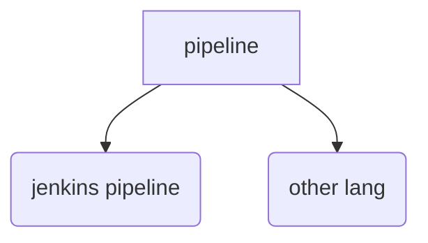

# Motivation
jenkinsfile is proper for automating job.
however, the jenkins syntax seem s long and hard to debug.

this project is to develope a metiod to write jenkinfile stablily and easily 


# Information 
## front lang
Python:
* positive: easy, object-orient-lang
* negtive: slow , no type

##  backend
rust:
* positive: faster, type-friend,  func-orient-lang
* negtive: no obj


使用rust 实现底层节点

## jenkinsfile source code, 
which may reduce class-defination

## 技术方案选型
1. pyparser 可以对python的lang生成语法树，-- 
2. 将py语法树节点和 rust 实现的jenkins 节点绑定
3. 在rust 层实现print

# UserInterface and requirement

```python
with Pipeline():
    param=xxx

    paralle
       with Stage(condition, ) : # steps
           cmd.run()
           cmd.run()
       with Stage(xxx)


```


# Design
项目步骤
1. 先有功能，再提高性能。想用python 实现demo，然后再用rust 优化性能


扩展(发展)
